# 🔗 URL Shortener - Microservices Edition

## A modern, production-ready URL shortener built with microservices architecture, complete with monitoring, alerting, and a beautiful web interface.

## 🌟 What's This?
Transform long, ugly URLs into short, memorable links with this enterprise-grade URL shortener. Built with a modern microservices architecture, it's not just a URL shortener - it's a full-stack monitoring platform!


## 🎯 Perfect For:
**Developers** learning microservices

**Startups** needing a scalable URL shortener

**DevOps** teams practicing containerization

**Anyone** tired of long URLs!


## 📊 Features

### 🔗 Core Functionality

| Feature          | Description                                      | Status |
|------------------|--------------------------------------------------|--------|
| **URL Shortening** | Create short URLs with auto-generated or custom codes | ✅ Live |
| **Click Tracking** | Monitor how many times each link is clicked        | ✅ Live |
| **Expiration**     | Set automatic expiration dates for links          | ✅ Live |
| **Web Dashboard**  | Beautiful, responsive interface                   | ✅ Live |

---

## 🛠️ Tech Stack

| Layer      | Technology                 | Purpose                   |
|------------|-----------------------------|---------------------------|
| **Frontend**  | Nginx + HTML/Tailwind        | User interface            |
| **Backend**   | Python Flask + SQLite        | API & business logic      |
| **Monitoring**| Prometheus + Grafana         | Metrics & visualization   |
| **Alerting**  | AlertManager + Slack         | Notifications             |
| **Container** | Docker + Docker Compose      | Deployment                |

---
## 📈 Monitoring & Analytics

- **Real-time metrics** – Track URL creations and redirects  
- **Performance monitoring** – 95th percentile response times  
- **Error tracking** – Automatic alerting for issues  
- **Beautiful dashboards** – Pre-configured Grafana views  

---
## 🗂️ System Architecture

```mermaid
graph TB
    subgraph "User Facing"
        A[🌐 Users] --> B[Frontend<br/>Nginx:80]
    end
    
    subgraph "Application Layer"
        B --> C[Backend API<br/>Flask:5000]
        C --> D[(SQLite<br/>Database)]
    end
    
    subgraph "Monitoring Stack"
        C --> E[📊 Prometheus<br/>:9090]
        E --> F[📈 Grafana<br/>:3001]
        E --> G[🚨 AlertManager<br/>:9093]
        G --> H[💬 Slack]
    end
    
    style A fill:#e1f5fe
    style B fill:#f3e5f5
    style C fill:#e8f5e8
    style E fill:#fff3e0
    style F fill:#e0f2f1
    style G fill:#ffebee
```


---
🚀 Quick Start (3-Step Deployment)

 ```bash
# 1. Clone & setup
git clone <your-repo>
cd url-shortener-microservices

# 2. Deploy everything (it's magic! ✨)
docker-compose up -d

# 3. Celebrate! 🎉
echo "Your URL shortener is LIVE at http://localhost:80"
 ```

 ---
## 📸 Screenshots

### 🎨 Web Interface


### Docker & Docker-Compose


### 📊 Prometheus


### Metrics


### 🚨 AlertManager	


### 💬 slack


### 📈 Grafana


---
## videos 📽️

https://github.com/user-attachments/assets/5da1a69f-8261-42f0-b2a0-ddce584aa4f9

https://github.com/user-attachments/assets/ca21ed63-54e5-4a80-9a44-0461067935bf

https://github.com/user-attachments/assets/a6eb292d-1c09-4d8a-890f-90b2e128577f


## 🤝 Contributers
Hesham mohamed Elngar
Shady
Waleed 
Mostafa Saad

 

